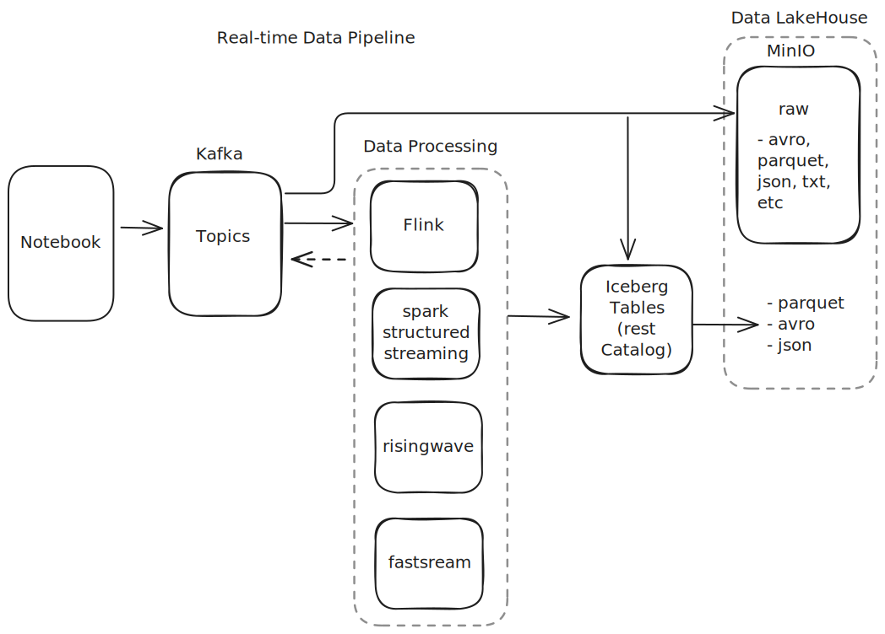

# Overview

Repo to learn and test real-time data ingestion and processing using kafka,flink, spark streaming, ml inference and apache iceberg.

# Data flow

1. apache kafka -> apache flink -> kafka
2. apache kafka -> apache flink -> iceberg / s3
3. apache kafka -> apache spark -> iceberg / s3
4. apache kafka -> risingwave
5. apache kafka -> emotion sentiment analysis (python) -> kafka

# Examples

The first step is to run `chmod +x setup.sh && ./setup.sh` from the project root. This will download the raw source data that will be sent to kafka line by line.

### apache kafka -> apache flink -> kafka

#### Sentiment Analysis

Run `docker compose -f docker-compose-flink.yaml up -d && ./scripts/run-flink-sentiment.sh`

This creates a kafka topic as a source and then runs a flink job that tokenizes and classifies each line of text. The results are piped into a separate kafka topic.

Results can be seen by navigating to `localhost:8888` and opening the `kafka-flink-sentiment` notebook.

### apache kafka -> s3 & apache kafka -> apache flink -> s3

work in progress

### apache kafka -> apache spark -> iceberg / storage

Run `docker compose -f docker-compose-spark.yaml up -d && ./scripts/run-spark-stream.sh`

This program publishes data to a kafka topic which is then ingested using spark structured streaming and saved to an iceberg table. Results can be seen by navigating to `localhost:8888` and opening the `kafka-spark-stream` notebook.

Specify --output=iceberg when running the relevant docker exec command to save to iceberg.
Specify --output=><path> when running the relevant docker exec command to save to file.

Results can be seen by navigating to `localhost:8888` and opening the `kafka-spark-stream` notebook.

## apache kafka -> risingwave

Run `docker compose -f docker-compose-rw.yaml up -d`

Messages are published a kafka topic which is then ingested as a source table and materialized view using rising wave.
Navigate to `localhost:8888` and execute the cells in the `kafka-risingwave` notebook.

Results can be also seen via `psql -h localhost -p 4566 -d dev -U root` and querying the `<topic>_view` table.

## apache kafka -> ml inference -> kafka

Run `export COMPOSE_BAKE=true docker compose -f docker-compose-ml.yaml up -d`

Messages are published to a kafka topic which is ingested by the 'ml' service using python faststream and huggingface to produce an emotion sentiment analysis that is sent back as a kafka topic. The topic names can be set in the docker-compose.yaml for notebook and ml services.

navigate to `localhost:8888` and execute the cells in the `kafka-ml-inference` notebook.

## logs

see mounted volumes in the docker-compose.yaml
ex. services/flink/log/jobmanager

# Notes

Work is an extension of https://github.com/databricks/docker-spark-iceberg, https://quix.io/blog/pyflink-deep-dive, and
https://github.com/jaehyeon-kim/flink-demos
